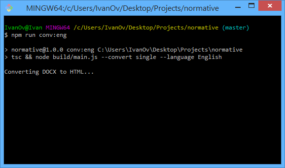
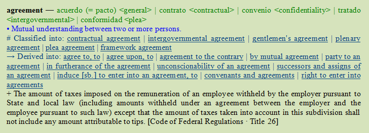
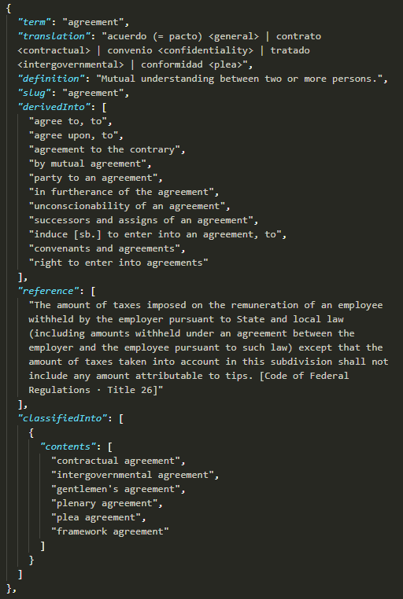
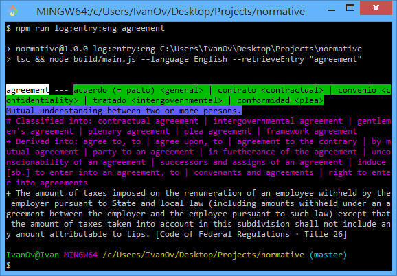
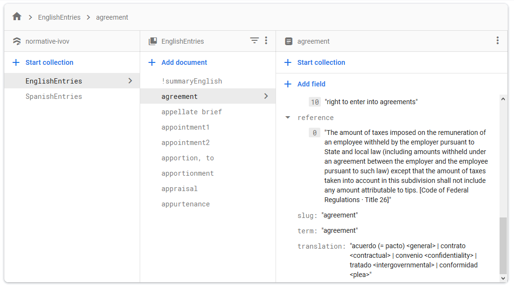
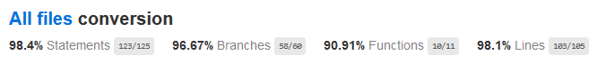
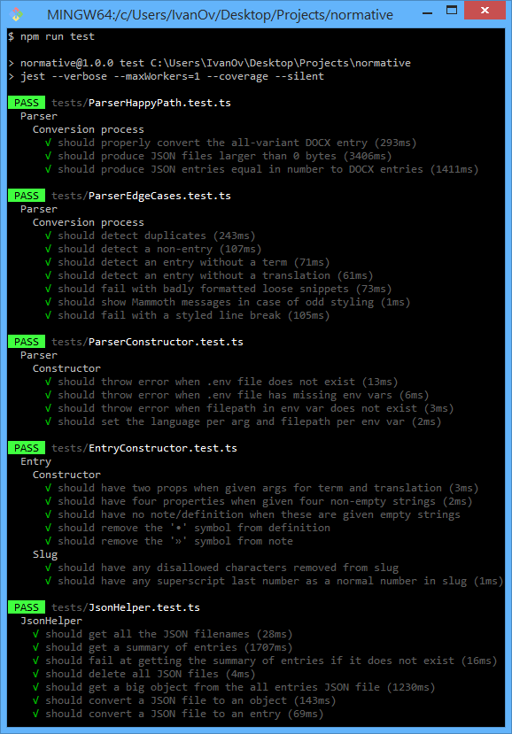

# normative

 [](https://opensource.org/licenses/MIT)

Desktop app for developing a legal dictionary and managing legal terminology.

Built with TypeScript/Node, Electron, Firebase and MongoDB.

<p align="center">
    
    &nbsp;&nbsp;&nbsp;&nbsp;
    
    &nbsp;&nbsp;&nbsp;&nbsp;
    
    &nbsp;&nbsp;&nbsp;&nbsp;
    
</p>

## Overview

Desktop app for:

1. parsing entries from two giant legal dictionaries in DOCX → `Parser`
2. displaying, editing and exploring interconnected entries → `Client`

The app is intended to facilitate the development of a bilingual legal dictionary.

:construction: **Work in progress**: The data conversion section of the app is complete, while the interface is under construction.

Features:

- User interface built with Tailwind CSS (forthcoming!)
- TypeScript/Electron client and IPC channels
- Authentication via Google Sign In + Firebase
- Embedded web content from third-party sources (forthcoming!)
- Storage of user preferences and search history (forthcoming!)
- Snappy DOCX-to-JSON parser in TypeScript/Node
- Completely tested and documented conversion process

## Structure

```
.
├── client            # desktop app
├── config            # credentials management
├── db                # DB managers, models, JSON/DOCX data
├── docs              # documentation materials
├── services          # parsing logic and helpers
├── utils
└── tests
```

## Installation

1. Install [Node v10.15.1](https://nodejs.org/en/download/)
2. Clone repo and install dependencies.
3. Set up Firestore and Firebase Auth: See below
4. Set up MongoDB: See below

### Firestore and Firebase Auth setup

1. Go to the [Firebase console](https://console.firebase.google.com/) and `Add project`
2. Select `Database` from the left nav and `Create database`
3. At the Firebase Console, go to `Project Overview` → `+ Add app` → `Web`
4. Name the web app and note down its `apiKey`, `authDomain` and `projectId`.

**TODO**: Write instructions for getting Google OAuth credentials.

5. Create the following `.env` file at the `/config` dir.

```
# DOCX filepaths
DOCX_PATH_ENGLISH="db/data/docx/sample_eng.docx"
DOCX_PATH_SPANISH="db/data/docx/sample_spa.docx"

# Firebase credentials
FIREBASE_API_KEY="yourApiKey"
FIREBASE_AUTH_DOMAIN="your.auth.domain"
FIREBASE_PROJECT_ID="yourProjectId"

# Google OAuth credentials
GOOGLE_OAUTH_CLIENT_ID="yourOAuthClientId"
GOOGLE_OAUTH_CLIENT_SECRET="yourOAuthClientSecret"
GOOGLE_OAUTH_REDIRECT_URI="yourOAuthRedirectUri"
GOOGLE_OAUTH_AUTHORIZE_URL="yourAuthorizeUrl"
GOOGLE_OAUTH_RESPONSE_TYPE="token"
GOOGLE_OAUTH_SCOPE="yourOauthScopes"
```

### MongoDB setup

1. Install [MongoDB Community Server](https://www.mongodb.com/download-center/community), including MongoDB compass.
2. In MongoDB compass, connect to `mongodb://localhost:27017/`.
3. Create a db called `normative` and, inside it, create two collections: `EnglishEntries` and `SpanishEntries`
4. Index both collections on the `term` field.

## Project scripts

```
$ npm run [script]
```

### Development

| Script       | Action                                                                         |
| ------------ | ------------------------------------------------------------------------------ |
| `client`     | Run the Electron client.                                                       |
| `dev-client` | Run the Electron client while hot-reloading/recompiling any changes.           |
| `test`       | Run ~30 unit tests for the parser.                                             |
| `css`        | Optimize `./client/css/tailwind.css` with PostCSS plugins, only in production. |

### JSON management

| Script                 | Action                                                                          |
| ---------------------- | ------------------------------------------------------------------------------- |
| `conv:eng`             | Convert the source English DOCX into a single JSON file and a summary file.     |
| `conv:spa`             | Convert the source Spanish DOCX into a single JSON file and a summary file.     |
| `del:json:eng`         | Delete all JSON files in the `./conversion/json/English` directory.             |
| `del:json:spa`         | Delete all JSON files in the `./conversion/json/Spanish` directory.             |
| `log:entry:eng [term]` | Retrieve an English entry from JSON and log it to the console in pretty colors. |
| `log:entry:spa [term]` | Retrieve a Spanish entry from JSON and log it to the console in pretty colors.  |

### Firestore management

| Script         | Action                                                                                          |
| -------------- | ----------------------------------------------------------------------------------------------- |
| `imp:fire:eng` | Import the single English JSON file and summary into the `EnglishEntries` Firestore collection. |
| `imp:fire:spa` | Import the single Spanish JSON file and summary into the `SpanishEntries` Firestore collection. |
| `del:fire:eng` | Delete all English entries from the `EnglishEntries` Firestore collection.                      |
| `del:fire:spa` | Delete all Spanish entries from the `SpanishEntries` Firestore collection.                      |

### MongoDB management

| Script          | Action                                                                                        |
| --------------- | --------------------------------------------------------------------------------------------- |
| `imp:mongo:eng` | Import the single English JSON file and summary into the `EnglishEntries` MongoDB collection. |
| `imp:mongo:spa` | Import the single Spanish JSON file and summary into the `SpanishEntries` MongoDB collection. |
| `del:mongo:eng` | Delete all English entries from the `EnglishEntries` MongoDB collection.                      |
| `del:mongo:spa` | Delete all Spanish entries from the `SpanishEntries` MongoDB collection.                      |

## Parser

<p align="center">
    
</p>

Designed for efficiently parsing two giant English-Spanish and Spanish-English legal dictionaries in DOCX format, each containing over 90,000 entries with richly formatted fields such as `term`, `translation`, `definition`, `note`, `classifiedUnder`, `classifiedInto`, `tantamountTo`, `differentFrom`, `derivedFrom`, `derivedInto` and `reference`. Since the original DOCX files are proprietary, small samples of these files are included in the `./conversion/docx` directory.

The conversion process maps MS Word styles to custom tags for four fields, transforms all entries into HTML, extracts the text of custom tagged and non-custom-tagged (i.e. "loose") fields, parses each entry into an `Entry` object, and saves them all as one or multiple JSON files. Italics and superscript are retained!

<p align="center">
    &nbsp;&nbsp;&nbsp;&nbsp;
    
</p>

<p align="center">
    &nbsp;&nbsp;&nbsp;&nbsp;
    
</p>

<p align="center">
    &nbsp;&nbsp;&nbsp;&nbsp;
    
</p>

<p align="center">
    &nbsp;&nbsp;&nbsp;&nbsp;
    
</p>

### Test coverage for parser

<p align="center">
    
</p>

<p align="center">
    
</p>

## Client

The `Client` class controls the main process, spawns renderer processes and registers IPC channels for communication with the renderer processes. For now, the main process has three IPC channels registered for receiving and responding to requests from renderer processes: one for retrieving entries, one for retrieving summaries, and one for user login.

```ts
export default class Client {
	window: BrowserWindow | null;
	db: DB;

	constructor() {
		app.on("ready", this.createWindow);
		app.on("window-all-closed", this.onWindowAllClosed);
		app.allowRendererProcessReuse = true;

		this.db = new MongoDB("English");
		this.db.init();

		this.registerIpcChannels();
	}

	/**Sets up all the channels for handling events from the renderer process.*/
	registerIpcChannels() {
		const ipcChannels: IpcChannel[] = [
			new EntryChannel(this.db),
			new SummaryChannel(this.db),
			new AuthChannel()
		];

		ipcChannels.forEach(channel =>
			ipcMain.on(channel.name, (event, argument?: string) =>
				channel.handle(event, argument)
			)
		);
	}

	private createWindow() {
		// renderer process
		this.window = new BrowserWindow({
			width: 800,
			height: 600,
			resizable: false,
			webPreferences: { nodeIntegration: true }
		});

		this.window.loadURL("file://" + process.cwd() + "/client/index.html");
		this.window.webContents.openDevTools();

		this.window.on("closed", () => {
			this.window = null; // ensure destruction!
		});
	}

	private onWindowAllClosed = () => {
		if (process.platform === "darwin") return; // replicate macOS
		this.db.disconnect();
		app.quit();
	};
}
```

IPC requests originating in the view are encapsulated in the `IpcView` class used inside the renderer process. This class forwards the requests to the `Client` and promisifies (i.e. returns inside a `Promise`) the responses it receives.

```ts
export default class IpcView {
	private ipcRenderer = ipcRenderer;

	public request(channel: string, targetTerm?: string): Promise<any> {
		this.ipcRenderer.send(channel, targetTerm);

		return new Promise(resolve => {
			this.ipcRenderer.on(channel, (event, response) => {
				if (channel === "entry-channel")
					response.translation = this.encode(response.translation);
				resolve(response);
			});
		});
	}
}
```

## Author

© 2020 Iván Ovejero

## License

Distributed under the MIT License. See [LICENSE.md](LICENSE.md)
