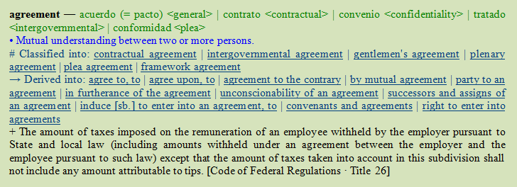
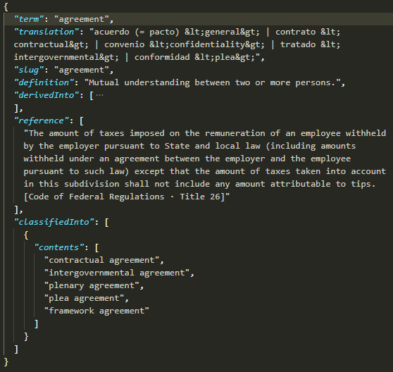
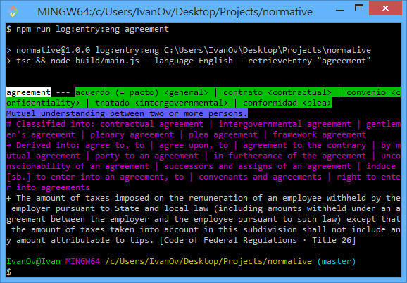
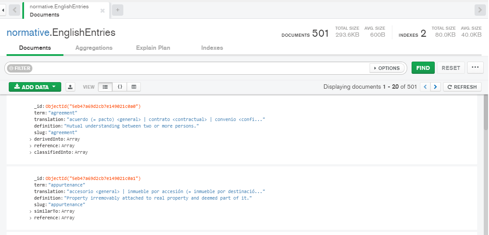
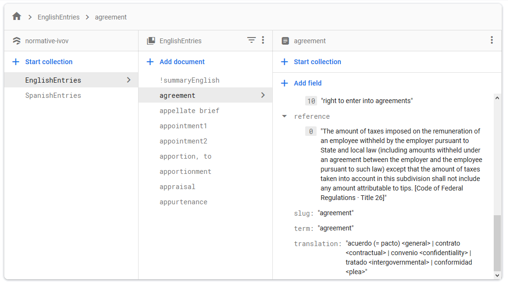
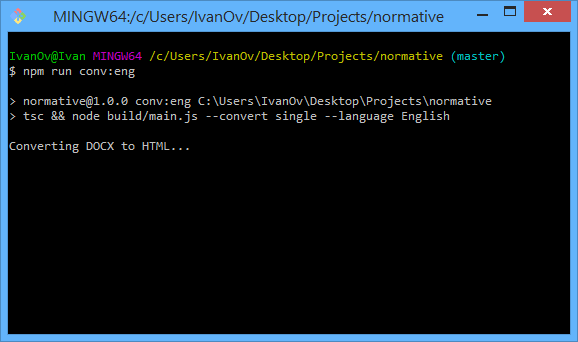
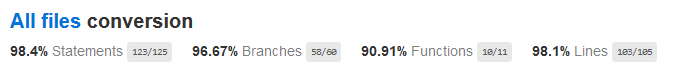
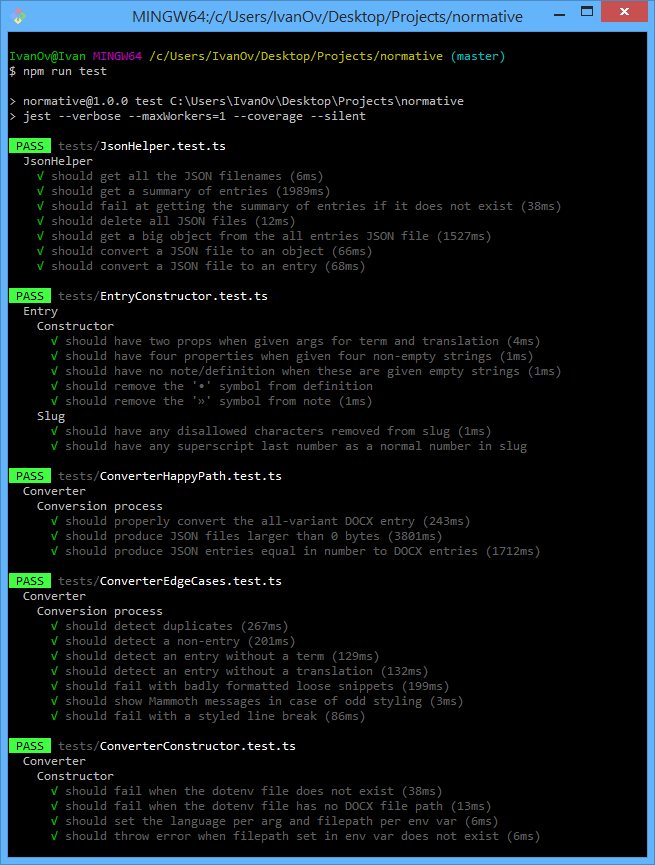

# normative

 [](https://opensource.org/licenses/MIT)

Desktop app for developing a legal dictionary and managing legal terminology.

Built with TypeScript/Node, Electron, Firebase and MongoDB.

<p align="center">
    
    &nbsp;&nbsp;&nbsp;&nbsp;
    
    &nbsp;&nbsp;&nbsp;&nbsp;
    
    &nbsp;&nbsp;&nbsp;&nbsp;
    
</p>

## Overview

:construction: **Work in progress** :construction:

Desktop app for importing `.docx` files into a bilingual legal dictionary, searching and exploring interconnected entries, and facilitating the various tasks that go into developing a legal dictionary.

It relies on two NoSQL databases, MongoDB and Firestore, and includes a CLI app written in TypeScript/Node for converting entries from `.docx` into `.json`, managing both databases, and logging entries to the console.

Features:

- Interface built with Tailwind CSS
- Authentication via Google Sign In
- Class-based client and IPC channels
- Embedded content from web sources
- Preferences and search history storage
- Snappy conversion, even for large files
- Fully tested and documented conversion

## Installation

1. Install [Node](https://nodejs.org/en/download/)
2. Clone repository and install dependencies: `npm install`
3. Install [MongoDB Community Server](https://www.mongodb.com/download-center/community)
4. Set up Firestore: See below
5. Set up MongoDB: See below

### Firestore setup

1. Go to the [Firebase console](https://console.firebase.google.com/) and `Add project`
2. Select `Database` from the left nav and `Create database`
3. At the Firebase Console, go to `Project Overview` → `+ Add app` → `Web`
4. Name the web app and note down its `apiKey`, `authDomain` and `projectId`.
5. Create the following `.env` file at the root dir of the project:

```
API_KEY="yourapikey"
AUTH_DOMAIN="your.auth.domain"
PROJECT_ID="yourprojectid"
DOCX_PATH_ENGLISH="conversion/docx/sample_eng.docx"
DOCX_PATH_SPANISH="conversion/docx/sample_spa.docx"
```

`DOCX_PATH_ENGLISH` and `DOCX_PATH_SPANISH` point to the default paths to the target DOCX files for conversion, to be changed as needed.

### MongoDB setup

1. During installation, tick the option to install also MongoDB compass.
2. In MongoDB compass, connect to `mongodb://localhost:27017/`.
3. Create a db called `normative` and, inside it, create two collections: `EnglishEntries` and `SpanishEntries`
4. Index both collections on the `term` field.

## Project structure

```
.
├── client            // Electron app
├── conversion        // DOCX-to-JSON converter
├── db                // DB managers and models
├── demo              // Documentation materials
├── logs              // Logger for converter
├── utils             // CLI and other utilities
└── tests             // Tests for converter
```

## Project scripts

```
$ npm run [script]
```

| Keys                   | Action                                                                                          |
| ---------------------- | ----------------------------------------------------------------------------------------------- |
| `client`               | Run the Electron client.                                                                        |
| `dev-client`           | Run the Electron client while hot-reloading any changes.                                        |
| `test`                 | Run ~30 unit tests for the converter.                                                           |
| `css`                  | Run `tailwind.css` file through all PostCSS plugins, only if in production.                     |
| `conv:eng`             | Convert the target English DOCX into a single JSON file and a summary file.                     |
| `conv:spa`             | Convert the target Spanish DOCX into a single JSON file and a summary file.                     |
| `log:entry:eng [term]` | Retrieve an English entry and logs it to the console in pretty colors.                          |
| `log:entry:spa [term]` | Retrieve a Spanish entry and logs it to the console in pretty colors.                           |
| `del:json:eng`         | Delete all JSON entries in the `./conversion/json/English` directory.                           |
| `del:json:spa`         | Delete all JSON entries in the `./conversion/json/Spanish` directory.                           |
| `imp:mongo:eng`        | Import the single English JSON file and summary into the `EnglishEntries` MongoDB collection.   |
| `imp:mongo:spa`        | Import the single Spanish JSON file and summary into the `SpanishEntries` MongoDB collection.   |
| `del:mongo:eng`        | Delete all English entries from the `EnglishEntries` MongoDB collection.                        |
| `del:mongo:spa`        | Delete all Spanish entries from the `SpanishEntries` MongoDB collection.                        |
| `imp:fire:eng`         | Import the single English JSON file and summary into the `EnglishEntries` Firestore collection. |
| `imp:fire:spa`         | Import the single Spanish JSON file and summary into the `SpanishEntries` Firestore collection. |
| `del:fire:eng`         | Delete all English entries from the `EnglishEntries` Firestore collection.                      |
| `del:fire:spa`         | Delete all Spanish entries from the `SpanishEntries` Firestore collection.                      |

## Converter

Designed for parsing two large English-Spanish and Spanish-English legal dictionaries in `.docx` format, each containing over 100,000 richly formatted entries with various fields such as `term`, `translation`, `definition`, `note`, `classifiedUnder`, `classifiedInto`, `tantamountTo`, `differentFrom`, `derivedFrom`, `derivedInto` and `reference`. Its output may be one or multiple `.json` files, for later storage in MongoDB/Firestore or viewing in-terminal. The conversion process maps MS Word styles to custom tags for `term`, `translation`, `definition` and `note`, transforms all entries into HTML, extracts the text inside the HTML tags and parses it into `Entry` objects, then saving them as one or multiple `.json` files. Italics and superscript segments in entries are retained.

<p align="center">
    &nbsp;&nbsp;&nbsp;&nbsp;
    
</p>

<p align="center">
    &nbsp;&nbsp;&nbsp;&nbsp;
    
</p>

<p align="center">
    &nbsp;&nbsp;&nbsp;&nbsp;
    
</p>

<p align="center">
    &nbsp;&nbsp;&nbsp;&nbsp;
    
</p>

<p align="center">
    &nbsp;&nbsp;&nbsp;&nbsp;
    
</p>

<p align="center">
    &nbsp;&nbsp;&nbsp;&nbsp;
    
</p>

### Test coverage for converter

<p align="center">
    
</p>

<p align="center">
    
</p>

## Client

Electron components are encapsulated in a `Client` class, which controls the main process, spawns renderer processes and registers IPC channels for communication with the view.

```ts
export default class Client {
	window: BrowserWindow | null;
	db: DB;

	constructor() {
		app.on("ready", this.createWindow);
		app.on("window-all-closed", this.onWindowAllClosed);
		app.allowRendererProcessReuse = true;

		this.db = new MongoDB("English");
		this.db.init();

		this.registerIpcChannels();
		this.initializeFirebase();
	}

	/**Sets up all the channels for handling events from the renderer process.*/
	registerIpcChannels() {
		const ipcChannels: IpcChannel[] = [
			new EntryChannel(this.db),
			new SummaryChannel(this.db),
			new AuthChannel()
		];

		ipcChannels.forEach(channel =>
			ipcMain.on(channel.name, (event, argument?: string) =>
				channel.handle(event, argument)
			)
		);
	}

	private createWindow() {
		this.window = new BrowserWindow({
			width: 800,
			height: 600,
			resizable: false,
			webPreferences: { nodeIntegration: true }
		});

		this.window.loadURL("file://" + process.cwd() + "/client/index.html");
		this.window.webContents.openDevTools();

		this.window.on("closed", () => {
			this.window = null; // ensure destruction
		});
	}

	private onWindowAllClosed = () => {
		if (process.platform === "darwin") return; // keep process in background to replicate macOS
		this.db.disconnect();
		app.quit();
	};
}
```

IPC requests originating in the view are encapsulated in the `IpcView` class, which sends requests to the `Client` and act once it receives the responses.

```ts
export default class IpcView {
	private ipcRenderer = ipcRenderer;

	/**Forwards the channel and an optional target term to `Client`. `Client` processes the request based on its registered IPC channels and sends back a response. `IpcView` receives the response and returns it inside a promise.*/
	public request(channel: string, targetTerm?: string): Promise<any> {
		this.ipcRenderer.send(channel, targetTerm);

		return new Promise(resolve => {
			ipcRenderer.on(channel, (event, response) => {
				resolve(response);
			});
		});
	}
}
```

## Author

© 2020 Iván Ovejero

## License

Distributed under the MIT License. See [LICENSE.md](LICENSE.md)
